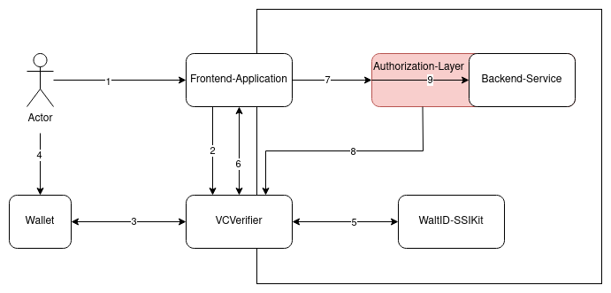

# VCVerifier for SIOP-2/OIDC4VP 

VCVerifier provides the necessary endpoints(see [API](./api/api.yaml)) to offer [SIOP-2](https://openid.net/specs/openid-connect-self-issued-v2-1_0.html#name-cross-device-self-issued-op)/[OIDC4VP](https://openid.net/specs/openid-4-verifiable-presentations-1_0.html#request_scope) compliant authentication flows. It exchanges [VerfiableCredentials](https://www.w3.org/TR/vc-data-model/) for [JWT](https://www.rfc-editor.org/rfc/rfc7519), that can be used for authorization and authentication in down-stream components.

[](https://www.fiware.org/developers/catalogue/)
[](https://opensource.org/licenses/Apache-2.0)
[](https://quay.io/repository/fiware/vcverifier)
[](https://coveralls.io/github/FIWARE/VCVerifier?branch=main)[](https://github.com/FIWARE/VCVerifier/actions/workflows/test.yaml)
[](https://github.com/FIWARE/VCVerifier/actions/workflows/release.yml)

## Contents

* [Background](#background)
    * [Overview](#overview)
* [Install](#install)
    * [Container](#container)
    * [Kubernetes](#kubernetes)
    * [Local Setup](#local-setup)
    * [Configuration](#configuration)
        * [Templating](#templating)
    * [WaltID SSIKit](#waltid-ssikit)
* [Usage](#usage)
    * [Frontend-Integration](#frontend-integration)
    * [REST-Example](#rest-example)
* [API](#api)
    * [Open Issues](#open-issues)
* [Testing](#testing)
* [License](#license)

## Background

[VerifiableCredentials](https://www.w3.org/TR/vc-data-model/) provide a mechanism to represent information in a tamper-evident and therefor trustworthy way. The term "verifiable" refers to the characteristic of a credential being able to be verified by a 3rd party(e.g. a verifier). Verification in that regard means, that it can be proven, that the claims made in the credential are as they were provided by the issuer of that credential. 
This characteristics make [VerifiableCredentials](https://www.w3.org/TR/vc-data-model/) a good option to be used for authentication and authorization, as a replacement of other credentials types, like the traditional username/password. The [SIOP-2](https://openid.net/specs/openid-connect-self-issued-v2-1_0.html#name-cross-device-self-issued-op)/[OIDC4VP](https://openid.net/specs/openid-4-verifiable-presentations-1_0.html#request_scope) standards define a flow to request and present such credentials as an extension to the well-established [OpenID Connect](https://openid.net/connect/).
The VCVerifier provides the necessary endpoints required for a `Relying Party`(as used in the [SIOP-2 spec](https://openid.net/specs/openid-connect-self-issued-v2-1_0.html#name-abbreviations)) to participate in the authentication flows. It verifies the credentials using the [Trustbloc Libraries](https://github.com/trustbloc/vc-go) to provide Verfiable Credentials specific functionality and return a signed [JWT](https://www.rfc-editor.org/rfc/rfc7519), containing the credential as a claim, to be used for further interaction by the participant.

### Overview

The following diagram shows an example of how the VCVerifier would be placed inside a system, using VerifiableCredentials for authentication and authorization. It pictures a Human-2-Machine flow, where a certain user interacts with a frontend and uses its dedicated Wallet(for example installed on a mobile phone) to participate in the SIOP-2/OIDC4VP flow.



The following actions occur in the interaction:

1. The user opens the frontend application.
2. The frontend-application forwards the user to the login-page of VCVerifier
3. The VCVerifier presents a QR-code, containing the ```openid:```-connection string with all necessary information to start the authentication process. The QR-code is scanned by the user's wallet.
    1. the Verifier retrieves the Scope-Information from the Config-Service
4. The user approves the wallet's interaction with the VCVerifier and the VerifiableCredential is presented via the OIDC4VP-flow. 
5. VCVerifier verifies the credential:
    1. at WaltID-SSIKit with the configured set of policies
    2. (Optional) if a Gaia-X compliant chain is provided
    3. that the credential is registered in the configured trusted-participants-registries
    4. that the issuer is allowed to issuer the credential with the given claims by one of the configured trusted-issuers-list(s)
6. A JWT is created, the frontend-application is informed via callback and the token is retrieved via the token-endpoint.
7. Frontend start to interact with the backend-service, using the jwt.
8. Authorization-Layer requests the JWKS from the VCVerifier(this can happen asynchronously, not in the sequential flow of the diagram).
9. Authorization-Layer verifies the JWT(using the retrieved JWKS) and handles authorization based on its contents. 

## Install

### Container

The VCVerifier is provided as a container and can be run via ```docker run -p 8080:8080 quay.io/fiware/vcverifier```.

### Kubernetes

To ease the deployment on [Kubernetes](https://kubernetes.io/) environments, the helm-chart [i4trust/vcverfier](https://github.com/i4Trust/helm-charts/tree/main/charts/vcverifier) can be used. 

### Local setup

Since the VCVerifier requires a Trusted Issuers Registry and someone to issuer credentials, a local setup is not directly integrated into this repository. However, the [VC-Integration-Test](https://github.com/fiware/VC-Integration-Test) repository provides an extensive setup of various components participating in the flows. It can be used to run a local setup, either for trying-out or as a basis for further development. Run it via:
```shell
    git clone git@github.com:fiware/VC-Integration-Test.git
    cd VC-Integration-Test/
    mvn clean integration-test -Pdev
```
See the documentation in that repo for more information.

### Configuration

The configuration has to be provided via config-file. The file is either loaded from the default location at ```./server.yaml``` or from a location configured via the environment-variable ```CONFIG_FILE```. See the following yaml for documentation and default values:

```yaml
# all configurations related to serving the endpoints
server:
    # port to bin to
    port: 8080
    # folder to load the template pages from
    templateDir: "views/"
    # directory to load static content from
    staticDir: "views/static/"
# logging configuration
logging:
    # the log level, accepted options are DEBUG, INFO, WARN and ERROR
    level: "INFO"
    # should the log output be in structured json-format
    jsonLogging: true
    # should the verifier log all incoming requests 
    logRequests: true
    # a list of paths that should be excluded from the request logging. Can f.e. be used to omit continuous health-checks
    pathsToSkip:

# configuration directly connected to the functionality 
verifier: 
    # did to be used by the verifier.
    did:
    # address of the (ebsi-compliant) trusted-issuers-registry to be used for verifying the issuer of a received credential
    tirAddress:
    # Expiry(in seconds) of an authentication session. After that, a new flow needs to be initiated.
    sessionExpiry: 30
    # scope(e.g. type of credential) to be requested from the wallet. if not configured, not specific scope will be requested.
    requestScope:
    # Validation mode for validating the vcs. Does not touch verification, just content validation.
	# applicable modes:
	# * `none`: No validation, just swallow everything
	# * `combined`: ld and schema validation
	# * `jsonLd`: uses JSON-LD parser for validation
	# * `baseContext`: validates that only the fields and values (when applicable)are present in the document. No extra fields are allowed (outside of credentialSubject).
	# Default is set to `none` to ensure backwards compatibility
    validationMode: 

# configuration of the service to retrieve configuration for
configRepo:
    # endpoint of the configuration service, to retrieve the scope to be requested and the trust endpoints for the credentials.
    configEndpoint: http://config-service:8080
    # static configuration for services
    services: 
        # name of the service to be configured
        testService: 
            # scope to be requested from the wallet
            scope: 
                - VerifiableCredential
                - CustomerCredential
            # trusted participants endpoint configuration 
            trustedParticipants:
                # the credentials type to configure the endpoint(s) for
                VerifiableCredential: 
                - https://tir-pdc.gaia-x.fiware.dev
                # the credentials type to configure the endpoint(s) for
                CustomerCredential: 
                - https://tir-pdc.gaia-x.fiware.dev
            # trusted issuers endpoint configuration
            trustedIssuers:
                # the credentials type to configure the endpoint(s) for
                VerifiableCredential: 
                - https://tir-pdc.gaia-x.fiware.dev
                # the credentials type to configure the endpoint(s) for
                CustomerCredential: 
                - https://tir-pdc.gaia-x.fiware.dev

```
#### Templating

The login-page, provided at ```/api/v1/loginQR```, can be configured by providing a different template in the ```templateDir```. The templateDir needs to contain a file named ```verifier_present_qr.html``` which will be rendered on calls to the login-api. The template needs to include the QR-Code via ```<img src="data:{{.qrcode}}"```. Beside that, all options provided by the [goview-framework](https://github.com/foolin/goview) can be used. Static content(like icons, images) can be provided through the ```staticDir``` and will be available at the path ```/static```.

## Usage

The VCVerifier provides support for integration in frontend-applications(e.g. typical H2M-interactin) or plain api-usage(mostly M2M). 

### Frontend-Integration

In order to ease the integration into frontends, VCVerifier offers a login-page at ```/api/v1/loginQR```. The loginQr-endpoint expects a ```state```(that will be used on the callback, so that the calling frontend-application can identify the user-session) and a ```client_callback``` url, which will be contacted by the verifier after successfull verfication via ```GET``` with the query-parameters ```state```(the originally send state) and ```code```(which is the authorization_code to be provided at the token endpoint for retrieving the actual JWT). 

### REST-Example

In order to start a ```same-device```-flow(e.g. the credential is hold by the requestor, instead of an additional device like a mobile wallet) call:
```shell
curl -X 'GET' \
  'http://localhost:8080/api/v1/samedevice?state=274e7465-cc9d-4cad-b75f-190db927e56a'
```

The response will be a ```302-Redirect```, containing a locationheader with all necessary parameters to continue the process. If the redirect should go to an alternative path, provide the ```redirect_path```query parameter.

```
    location: http://localhost:8080/?response_type=vp_token&response_mode=direct_post&client_id=did:key:z6MkigCEnopwujz8Ten2dzq91nvMjqbKQYcifuZhqBsEkH7g&redirect_uri=http://verifier-one.batterypass.fiware.dev/api/v1/authentication_response&state=OUBlw8wlCZZOcTwRN2wURA&nonce=wqtpm60Jwx1sYWITRRZwBw
```

The redirect should be taken and then answered via ```authentication_response```-endpoint. Make sure that the vp_token and presentation_submission use Base64-URL-Safe encoding, instead of just Base64-encoding.
```shell
curl -X 'POST' \
  'https://localhost:8080/api/v1/authentication_response?state=OUBlw8wlCZZOcTwRN2wURA' \
  -H 'accept: */*' \
  -H 'Content-Type: application/x-www-form-urlencoded' \
  -d 'presentation_submission=ewogICJpZCI6ICJzdHJpbmciLAogICJkZWZpbml0aW9uX2lkIjogIjMyZjU0MTYzLTcxNjYtNDhmMS05M2Q4LWZmMjE3YmRiMDY1MyIsCiAgImRlc2NyaXB0b3JfbWFwIjogWwogICAgewogICAgICAiaWQiOiAiaWRfY3JlZGVudGlhbCIsCiAgICAgICJmb3JtYXQiOiAibGRwX3ZjIiwKICAgICAgInBhdGgiOiAiJCIsCiAgICAgICJwYXRoX25lc3RlZCI6ICJzdHJpbmciCiAgICB9CiAgXQp9&vp_token=ewogICJAY29udGV4dCI6IFsKICAgICJodHRwczovL3d3dy53My5vcmcvMjAxOC9jcmVkZW50aWFscy92MSIKICBdLAogICJ0eXBlIjogWwogICAgIlZlcmlmaWFibGVQcmVzZW50YXRpb24iCiAgXSwKICAidmVyaWZpYWJsZUNyZWRlbnRpYWwiOiBbCiAgICB7CiAgICAgICJ0eXBlcyI6IFsKICAgICAgICAiUGFja2V0RGVsaXZlcnlTZXJ2aWNlIiwKICAgICAgICAiVmVyaWZpYWJsZUNyZWRlbnRpYWwiCiAgICAgIF0sCiAgICAgICJAY29udGV4dCI6IFsKICAgICAgICAiaHR0cHM6Ly93d3cudzMub3JnLzIwMTgvY3JlZGVudGlhbHMvdjEiLAogICAgICAgICJodHRwczovL3czaWQub3JnL3NlY3VyaXR5L3N1aXRlcy9qd3MtMjAyMC92MSIKICAgICAgXSwKICAgICAgImNyZWRlbnRpYWxzU3ViamVjdCI6IHt9LAogICAgICAiYWRkaXRpb25hbFByb3AxIjoge30KICAgIH0KICBdLAogICJpZCI6ICJlYmM2ZjFjMiIsCiAgImhvbGRlciI6IHsKICAgICJpZCI6ICJkaWQ6a2V5Ono2TWtzOW05aWZMd3kzSldxSDRjNTdFYkJRVlMyU3BSQ2pmYTc5d0hiNXZXTTZ2aCIKICB9LAogICJwcm9vZiI6IHsKICAgICJ0eXBlIjogIkpzb25XZWJTaWduYXR1cmUyMDIwIiwKICAgICJjcmVhdG9yIjogImRpZDprZXk6ejZNa3M5bTlpZkx3eTNKV3FINGM1N0ViQlFWUzJTcFJDamZhNzl3SGI1dldNNnZoIiwKICAgICJjcmVhdGVkIjogIjIwMjMtMDEtMDZUMDc6NTE6MzZaIiwKICAgICJ2ZXJpZmljYXRpb25NZXRob2QiOiAiZGlkOmtleTp6Nk1rczltOWlmTHd5M0pXcUg0YzU3RWJCUVZTMlNwUkNqZmE3OXdIYjV2V002dmgjejZNa3M5bTlpZkx3eTNKV3FINGM1N0ViQlFWUzJTcFJDamZhNzl3SGI1dldNNnZoIiwKICAgICJqd3MiOiAiZXlKaU5qUWlPbVpoYkhObExDSmpjbWwwSWpwYkltSTJOQ0pkTENKaGJHY2lPaUpGWkVSVFFTSjkuLjZ4U3FvWmphME53akYwYWY5WmtucXgzQ2JoOUdFTnVuQmY5Qzh1TDJ1bEdmd3VzM1VGTV9abmhQald0SFBsLTcyRTlwM0JUNWYycHRab1lrdE1LcERBIgogIH0KfQ'
```
The post will be answered with just another redirect, containing the ```state``` and the ```code``` to be used for retrieving the JWT:
```
    location: http://localhost:8080/?state=274e7465-cc9d-4cad-b75f-190db927e56a&code=IwMTgvY3JlZGVudGlhbHMv
``` 

The original requestor now can use to retrieve the JWT through the standarad token flow: 

```shell
curl -X 'POST' \
  'https://localhost:8080/token' \
  -H 'accept: application/json' \
  -H 'Content-Type: application/x-www-form-urlencoded' \
  -d 'grant_type=authorization_code&code=IwMTgvY3JlZGVudGlhbHMv&redirect_uri=https%3A%2F%2Flocalhost%3A8080%2F'
```

which will be answered with(demo jwt, will be signed in reality):

```json
    {
    "token_type": "Bearer",
    "expires_in": 3600,
    "access_token": "ewogICJhbGciOiAiRVMyNTYiLAogICJraWQiOiAiV09IRnU0SFo1OVNNODUzQzdlTjBPdmxLR3JNZWVyRENwSE9VUm9UUXdIdyIsCiAgInR5cCI6ICJKV1QiCn0.ewogICJAY29udGV4dCI6IFsKICAgICJodHRwczovL3d3dy53My5vcmcvMjAxOC9jcmVkZW50aWFscy92MSIKICBdLAogICJ0eXBlIjogWwogICAgIlZlcmlmaWFibGVQcmVzZW50YXRpb24iCiAgXSwKICAidmVyaWZpYWJsZUNyZWRlbnRpYWwiOiBbCiAgICB7CiAgICAgICJ0eXBlcyI6IFsKICAgICAgICAiUGFja2V0RGVsaXZlcnlTZXJ2aWNlIiwKICAgICAgICAiVmVyaWZpYWJsZUNyZWRlbnRpYWwiCiAgICAgIF0sCiAgICAgICJAY29udGV4dCI6IFsKICAgICAgICAiaHR0cHM6Ly93d3cudzMub3JnLzIwMTgvY3JlZGVudGlhbHMvdjEiLAogICAgICAgICJodHRwczovL3czaWQub3JnL3NlY3VyaXR5L3N1aXRlcy9qd3MtMjAyMC92MSIKICAgICAgXSwKICAgICAgImNyZWRlbnRpYWxzU3ViamVjdCI6IHt9LAogICAgICAiYWRkaXRpb25hbFByb3AxIjoge30KICAgIH0KICBdLAogICJpZCI6ICJlYmM2ZjFjMiIsCiAgImhvbGRlciI6IHsKICAgICJpZCI6ICJkaWQ6a2V5Ono2TWtzOW05aWZMd3kzSldxSDRjNTdFYkJRVlMyU3BSQ2pmYTc5d0hiNXZXTTZ2aCIKICB9LAogICJwcm9vZiI6IHsKICAgICJ0eXBlIjogIkpzb25XZWJTaWduYXR1cmUyMDIwIiwKICAgICJjcmVhdG9yIjogImRpZDprZXk6ejZNa3M5bTlpZkx3eTNKV3FINGM1N0ViQlFWUzJTcFJDamZhNzl3SGI1dldNNnZoIiwKICAgICJjcmVhdGVkIjogIjIwMjMtMDEtMDZUMDc6NTE6MzZaIiwKICAgICJ2ZXJpZmljYXRpb25NZXRob2QiOiAiZGlkOmtleTp6Nk1rczltOWlmTHd5M0pXcUg0YzU3RWJCUVZTMlNwUkNqZmE3OXdIYjV2V002dmgjejZNa3M5bTlpZkx3eTNKV3FINGM1N0ViQlFWUzJTcFJDamZhNzl3SGI1dldNNnZoIiwKICAgICJqd3MiOiAiZXlKaU5qUWlPbVpoYkhObExDSmpjbWwwSWpwYkltSTJOQ0pkTENKaGJHY2lPaUpGWkVSVFFTSjkuLjZ4U3FvWmphME53akYwYWY5WmtucXgzQ2JoOUdFTnVuQmY5Qzh1TDJ1bEdmd3VzM1VGTV9abmhQald0SFBsLTcyRTlwM0JUNWYycHRab1lrdE1LcERBIgogIH0KfQ"
    }
```

## API

The API implements enpoints defined in [OIDC4VP](https://openid.net/specs/openid-4-verifiable-presentations-1_0.html#name-terminology) and [SIOP-2](https://openid.net/specs/openid-connect-self-issued-v2-1_0.html). The OpenAPI Specification of the implemented endpoints can be found at: [api/api.yaml](api/api.yaml).

### Open issues

The VCVerifier does currently not support all functionalities defined in the connected standards(e.g. [OIDC4VP](https://openid.net/specs/openid-4-verifiable-presentations-1_0.html#name-terminology) and [SIOP-2](https://openid.net/specs/openid-connect-self-issued-v2-1_0.html)). Users should be aware of the following points:

* the verifier does not yet verify the holder of a credential
* the verifier does not offer any endpoint to proof its own identity
* requests to the authentication-response endpoint do accept "presentation_submissions", but do not evaluate them
* even thought the vp_token can contain multiple credentials and all of them will be verified, just the first one will be included in the JWT

## Testing

Functionality of the verifier is tested via parameterized Unit-Tests, following golang-bestpractices. In addition, the verifier is integrated into the [VC-Integration-Test](https://github.com/fiware/VC-Integration-Test), involving all components used in a typical, VerifiableCredentials based, scenario. 


## License

VCVerifier is licensed under the Apache License, Version 2.0. See LICENSE for the full license text.

© 2023 FIWARE Foundation e.V.
